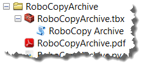

**RoboCopy Archive - An ArcGIS Script Tool To Archive Incident Data**

**Background** - Creating and maintaining a comprehensive digital
archive of an incident\'s GIS data, projects, and products is a critical
performance element for a GISS. Commercially available software
facilitates archiving, but many GISS may not have access to these
products.

A Python script tool described here uses the native Windows **RoboCopy**
utility to create and maintain an archive of an incident\'s GIS data
holdings.

During the initial archive session, the tool will copy the entirety of
an incident\'s GIS data holdings to a user-specified archive folder.
This is referred to as a \"full\" backup. The initial session could be
lengthy, depending on the size of GIS data holdings, as well as device
and network speed.

During subsequent archive sessions, the tool will only copy the files
and folders that have been created, edited, or renamed since the
previous session. This is referred to as an \"incremental\" backup and,
typically, will be much faster than the initial session, since many
fewer files will need to be copied.

Each archive session produces a time-stamped log file that lists and
summarizes all copied files. The log files are created in an
**ArchiveLogs** folder within the user-specified archive folder.

The archive folder should be hosted on a device or media that is
separate from the incident\'s primary data storage media. An external
USB hard drive is a typical choice.

Archiving should occur at the conclusion of each operational period\'s
data edit and map update cycle in the sequence described below.

1.  Make GDB and MXD backups to the dated **incident_data** and
    **projects** folders.

2.  Edit incident data.

3.  Update incident maps.

4.  Update the incident archive using **RoboCopy Archive**.

{width="2.0118055555555556in"
height="0.9409722222222222in"}**Setup** - Copy the **RoboCopyArchive**
folder to the incident\'s **tools** folder. The toolbox, script, and
guidance document will be visible when viewed in ArcCatalog, as
illustrated at right.

{width="2.7868055555555555in"
height="1.5333333333333334in"}**Use** - Double-click the **RoboCopy
Archive** script icon and specify:

1.  The incident\'s root folder (on a NAS device mapped to **Z:** in
    this example)

2.  An existing target archive folder (on an external USB drive mapped
    to **D:** in this example)

Then click **OK**, and the archive session will commence. When complete,
a log file listing and summarizing the session\'s transactions will be
displayed, as seen below.

{width="6.345833333333333in"
height="3.216666666666667in"}

{width="6.347222222222222in"
height="3.216666666666667in"}

**Results** -
{width="1.823611111111111in"
height="1.6055555555555556in"}The result of an archive session is that
all new, modified, and renamed files and folders will be copied to the
archive folder. The **ArchiveLogs** folder accumulates each session\'s
log files, as seen here.

**Other considerations** - The RoboCopy Archive tool has these
characteristics.

-   The tool does not \"mirror\" source data in the archive. In other
    words, if files or folders are deleted from the source, those items
    are **not** deleted from the archive, but are retained as \"extra\"
    files or folders in order to maintain a complete record of the
    incident\'s GIS data, projects, and products, even though some of
    the files or folders may have been discarded or become obsolete in
    the interim.

-   If edits are made to archived files, those archived files will be
    over-written by their corresponding source files during the next
    archive session.

-   Newly created folders are copied, but aren\'t shown in the list of
    copied items. They are, however, shown in the \"**Dirs:**\" category
    in the log file\'s summary.

-   The tool will skip open or locked files. In order to avoid an
    incomplete archive session, it is highly recommended that all users
    close out of ArcMap or Pro and reboot their PC to release any file
    locks or hung processes, and then take a short break (have a
    Jamwich!) while archiving occurs. The tool will retry copying open
    or locked files only once, and then will move on. Users are notified
    when files fail to copy, as illustrated below.

{width="6.440277777777778in"
height="2.2888888888888888in"}

Carl Beyerhelm

Sundance Consulting Inc

Rev 4 Dec 2017
